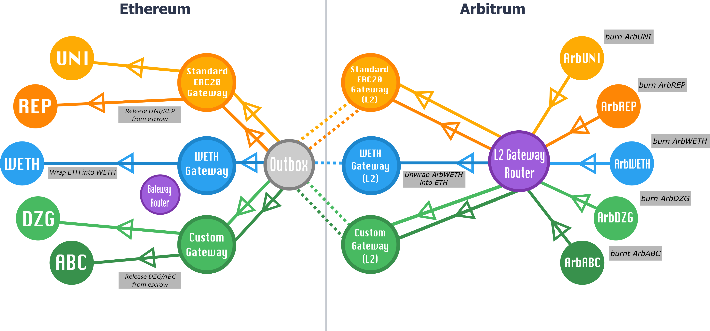

# 代币桥

Arbitrum[在layers间通信](./Layers间的通信.md)的能力可以用来在以太坊和Arbitrum之间进行免信任的资产转移。任何资产/资产类型在理论上都可以进行转移i，如ETH，ERC20代币，ERC-721代币等。

## 充值和提取以太
将ETH充值到Arbitrum上，需要执行`Inbox.depositEth`方法。该交易将L1上的ETH转移进Bridge合约中，并在Arbitrum链上指定的地址铸造等量的以太币。
```
function depositEth(address destAddr) external payable override returns (uint256)
```

所有充值资金都由Arbitrum的Bridge合约管理。ETH提款使用[ArbSys](../dapp基础/ArbSys预编译合约.md)中的withdrawEth方法：
```
ArbSys(100).withdrawEth{ value: 2300000 }(destAddress)
```

提现时，Arbitrum侧的ETH余额被销毁，之后在以太坊侧解锁等额以太。

`ArbSys.withdrawEth`实际上是与`ArbSys.sendTxToL1`等价的简便方法，其calldataForL1是空。如其他`sendTxToL1`方法一样，它还需要待挑战期过后在L1上调用`Outbox.executeTransaction`，以最终领取资金（见[在layers间通信](Layers间的通信.md)）。一旦一笔提现在收件箱中执行了，用户在L1上的ETH余额就会增加。

## ERC20代币的桥接
### 总括
Arbitrum协议本身在技术上并没有对任何特殊代币标准进行标记，也不存在内建的优先或特殊的代币桥。下面讨论的是Canonical Bridge权威桥，由Offchain Labs实现，也应该是用户和应用主要使用的桥；它是一组在以太坊和Arbitrum上的合约组成的dApp，利用Arbitrum的跨链通信机制来实现理想的代币桥接功能。我们推荐大家使用该桥。

### 设计原理
我们的设计原理受到了以太坊社区中很多开发者的影响，包括Optimism的Maurelian和Ben
Jones的[提案](https://ethereum-magicians.org/t/outlining-a-standard-interface-for-cross-domain-erc20-transfers/6151)，*David
Mihal*的工作，以及Arbitrum上许多项目的反馈，数量太多无法一一列出。

我们使用上述提案中的术语『Gateway 关口』来形容这一机制；具体来说，就是在两个不同域上工作的一对合约，来实现跨链资产转移。

三个核心目标驱动着桥接系统的设计：
1. **自定义Gateway功能**
对许多ERC20代币，『标准』的桥接功能已经足够了：以太坊上的代币合约在Arbitrum上会配对的代币合约。充值一种代币会将一定数量的该代币托管在L1 bridge合约上，在L2配对的合约上铸造等量的代币。L2上的配对合约与标准ERC20代币合约的行为非常像。

提现会在L2侧销毁一定数量的代币，稍后在L1 bridge合约上可领取。

不过，有许多代币需要自定义的Gateway，这些特殊情况很难被标准化地概括出来，例如：
* 被动生息类型的代币，持币者所持数量会自动增加，这种代币需要确保在L2侧的代币数量也会增加
* 我们的跨域WETH的实现要求在跨链转移之前要先封包/解包。

因此，桥的架构设计不能只止步于标准的充值/提现功能。新的自定义的Gateway也会不断加入进来。

2. **每个L1代币合约的L2权威体现**
有多个自定义的Gateway是挺不错的，但我们还是想避免一个L1代币在L2上有多个合约/地址（因为这显然让用户和开发者感到非常困惑）。因此，我们需要追踪哪个L1代币使用了哪个Gateway，然后再通过一个权威地址先知来确定以太坊到Arbitrum代币的映射关系。

3. **领域无关性**
[此帖](https://ethereum-magicians.org/t/outlining-a-standard-interface-for-cross-domain-erc20-transfers/6151)让我们认为早期就考虑周全是非常重要的；我们虽然目前专注于在以太坊和Arbitrum链之间的资产转移，但日后，Gateway将会发展为在各种rollup，分片以及其他L1组合进行转移的桥梁。因此我们遵循了域中性的语义，例如『outBoundTransfer』而不是类似『充值』或者『提款』等，来确保接口足够支持一些自定义（特定领域）扩展功能。

## 权威桥的实现
基于上述理念，我们给出了代币桥接的整体架构：

本架构由三种类型的合约组成：

1. **资产合约**：这些合约就是代币合约本身，如L1上的ERC20和其在Arbitrum上的对应合约。
2. **Gateways**：一对实现特定类型的跨链资产转移的合约（一个在L1上，一个在L2上）。
3. **路由**：一对（一个在L1一个在L2）将资产引导至对应的Gateway上的合约。

https://developer.offchainlabs.com/docs/assets/gatewayUML.svg

所有以太坊到Arbitrum的代币转移由`L1GatewayRouter`合约发起。`L1GatewayRouter`将代币的充值请求发送给`L1ArbitrumGateway`合约。`L1GatewayRouter`负责将L1代币地址映射至其L1 Gateway，由此作为L1/L2的地址权威先知，确保每个代币只对应一个Gateway。`L1ArbitrumGateway`与`L2ArbitrumGateway`进行通信（一般/预期通过[可重试票据](./Layers间的通信.md)）。

类似地，Arbitrum到以太坊转移也由`L2GatewayRouter`合约发起，将该请求发送给`L2ArbitrumGateway`，然后再与其对应的`L1ArbitrumGateway`通信（一般/预期通过发信息给发件箱）。

对任意给定的gateway匹配，我们都要求请求发起自`GatewayRouter`，并且该gateway符合`TokenGateway`接口标准；`TokenGateway`接口应该足够灵活，具有足够的可扩展性，以满足桥接任何特定代币的需求。

### 标准Arb-ERC20桥接

为阐述实践中该流程是怎样的，我们来看一下通过标准ERC20 gateway的`SomeERC20Token`实现的充值和提现。在此我们假设`SomeERC20Token`已经在`L1GatewayRouter`中注册使用了标准ERC20 Gateway。

**充值**
1. 用户调用`GatewayRouter.outBoundTransfer`（以`SomeERC20Token`的L1地址作为参数）
2. `GatewayRouter`查找 `SomeERC20Token`对应的gateway，并发现它是一个标准ERC20 gateway（`L1ERC20Gateway`合约）。
3. `GatewayRouter`调用`L1ERC20Gateway.outBoundTransfer`，传递合适的参数。
4. `L1ERC20Gateway`托管代币，创建retryable ticket来触发L2上的`L2ERC20Gateway`的`finalizeInboundTransfer`方法。
5. `finalizeInboundTransfer`在`arbSomeERC20Token`合约上铸造对应的代币数量。

注意，`arbSomeERC20Token`是`StandardArbERC20`的一个实例，其中包含了`bridgeMint`和`bridgeBurn`方法，只能由`L2ERC20Gateway`调用。


**提款**
1. 在Arbitrum上用户调用`L2GatewayRouter.outBoundTransfer`，它会在arbSomeERC20Token's的L2ERC20Gateway上再调用`outBoundTransfer`。
2. 该操作会销毁对应的arbSomeERC20Token，然后再调用ArbSys并附带一条编码过的给`L1ERC20Gateway.finalizeInboundTransfer`的信息，该信息最终会在L1上执行。
3. 在挑战期窗口结束且断言已经被确认后，用户可以调用`Outbox.executeTransaction`，它会继续调用`L1ERC20Gateway.finalizeInboundTransfer`的编码信息，将用户的代币从L1ERC20Gateway合约中释放。
   

**其他类型的Gateway**
在上述系统中，一对Gateway合约可以处理许多ERC20的桥接。也就是说，很多L1上的ERC20与其对应的Arbitrum ERC20都是通过一个gateway合约配对的。其他类型的gateway可能会与其桥接的合约有不同的关系。

以我们的WETH实现为例：单个WETH L1合约与单个WETH L2合约挂钩。当将WETH从一个域转移到另一个域，L1/L2 Gateway架构会将域A上的WETH解包为Ether，然后再在域B上封包。这确保了WETH在Arbitrum上的行为同在以太坊上的行为，同时也确保了所有WETH代币在其所在的layer上总是完全抵押的。

不论某些代币的桥接有多高的复杂度，原理上gateway总可以在权威桥系统内对其进行适配。

← [Layers间的通信](./Layers间的通信.md)

→ [确认与最终性](./确认与最终性.md)

