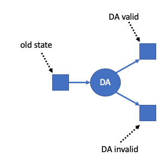
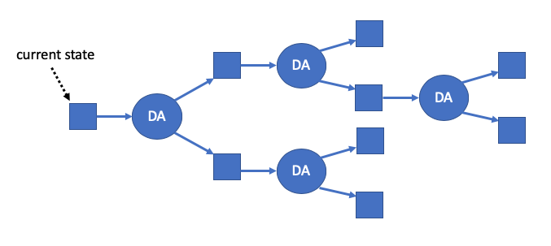
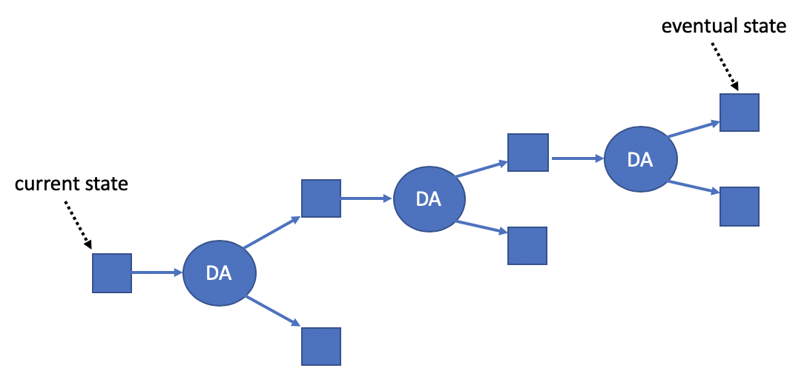
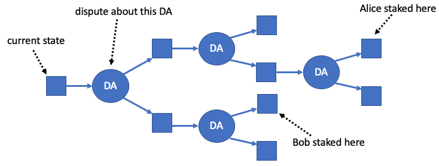

# Arbitrum Rollup 协议

# Arbitrum Rollup协议设计
Arbitrum是一个由链上以太坊合约管理的链下协议。dApp开发者可以将Solidity合约部署到Layer 2 Arbitrum Rollup链（ArbChain）上。

本文档从概念上描述了设计，可能有点比较正式。最后，我们证明该协议安全保证，到最后假设诚实的质押者。

## Rollup基础
我们从基本概念入手。VM的状态由默克尔树组成，所以可以计算出该VM状态的密码学哈希。在本协议的任何一点，VM的某些状态是已经完全确认具备最终性的，其哈希在（以太坊）链上存储。

协议中的参与者可以发起*可争议断言*（*Disputable Assertion*
，DA），DA以某个状态哈希起始。在符合一些技术性前提的情况下，VM可以执行特定步数的运算，并带来特定的新的状态哈希。VM在该过程总会执行特定的交易并发出特定的log事件。该DA可能是有效的（真实的）也可能是无效的。提出DA的一方需要质押一定资金为DA的有效性背书（下方会介绍更多质押的详情）。

上图，可争议断言创建了一个逻辑上的决策点，协议最终需要解决其走向。若DA有效，系统会进入右上方的新状态，更新其状态哈希，并根据DA产生一些附产物（交易和log）。若DA无效，则会被拒绝，VM状态不会发生改变。

### Arbitrum 2.0协议
当前的Arbitrum协议相比老版本的进步之处在于，允许多个并行的DA，每个状态可以跟随至多一个DA。如果DA没有后续状态，则任何人都可以在其后创建DA产生一个分支。结果就是下图所示，会产生一个可能未来情况的树。

### 质押
另一个协议的重要组成部分是质押。任何人都可以在树中的方块中进行质押。质押在方块上意味着你认为该方块最终会被协议所接受。也就是说，你宣称该路径上的每一个DA都是正确的。如果你错了，则质押资金会被没收。

质押操作是无法撤销的。你可以将质押向右移动——选择去每个分支的上分支还是下分支，但不能向左移动，因为那意味着你撤销了之前所作出的质押承诺。

而提出DA的人则需要在自认为的有效DA之后提出DA并为其质押。通常，他们会将质押物向右移动放置进所需的下一个方块中。如果还没有进行质押则需要先进性质押。

另一个关于质押的细节：如果你所质押的方块最终被确认并成为了公允历史，此时你可以取回自己的质押物。也就是说，只要你是正确的，你可以保持你的状态并等待系统追上你的断言，然后就可以取回质押物了。

也许你会担心状态树过于庞大，分支太多。但这在实践中是不太可能发生的，因为这意味着有多方质押在互斥的状态上。而他们其中只有一方是正确的，其余人最终都会失去所有质押物。正常情况是，该树是由一系列有效DA组成的，一个接一个，所有的质押都在相同的路径上。下图展示了该正常情况：基本是一系列『串行』的DA，最终会被接受。

### 质押截止时间
系统决定DA是否有效，不能花费太长时间。所以当DA加入链条、创建了一个分支点后，该DA就有了一个截止时间。该截止时间确保了每个人都有足够时间检查该DA是否有效，如果想质押的话则发起链上交易对该DA进行质押。如果有人想通过质押来支持或反对某DA，则必须在截止时间之前完成。（截止时间过后也可以质押，但并不会参与到该DA是正确或错误的判定中。）一旦过了截止时间，所有判定该DA的质押都是确定的了。

### 争议
如果Alice和Bob质押在不同的方块上，二者只能有一个是正确的。向右的路径如果在二者一致的情况下则只有一条连贯的路径，如果二者不一致则该路径不存在。如果没有二者之间没有连贯的路径，那一定是它们双方有争议点。二者之间总会存在一个DA，一方认为是有效的而另一方认为是无效的。

只要有争议，系统就会在双方之间启动一个交互式的争议解决协议。该争议解决协议[在此](./推进与解决争议.md)中有描述——类似我们之前在Arbitrum文档中说的分割式的互动协议。该争议协议需要双方依次轮流行动，每一步都有截止时间。在截止时间前没有行动的一方会输掉挑战。

争议解决协议的组中结果是错误的一方会被发现，并罚没其质押物。争议解决能确定其中一方是错误的，但并不能据此推导出另一方是正确的。也许双方都有错误，也许双方合谋来操控争议的解决。由于这些可能性的存在。质押物会从其质押的方块上移除，其中一部分分给其对手，另一部分将被销毁。

同时可以进行多个争议，但每个质押者每次只能进行一次争议。由于输掉的质押会被移除，每次争议解决都会减少系统中的分歧。失去质押物的人如果想的话也可以重新质押，但新的质押对已经过了质押截止时间的DA是没有任何影响的。

### 确认结果
一旦DA的质押截止时间过了，系统就能确认该DA的结果，所有剩余的及时放置的质押都会位于该DA的同一个分支上（上分支或下分支）。该DA要么被拒绝要么被接受，而当前状态也会移动到DA右侧合适的方块上。如果DA是有效的，其附产物如交易，则在链上就是有效的。这就是VM状态是如何推进的。

在常见情况下，各方诚实行动，因为谁都不想因为错误的断言而失去质押物，没有人为错误的分支质押，每个DA都能在截止时间后立即被确认。

### 为什么该过程是免信任的
Arbitrum Rollup协议的重要特性之一是免信任——只要有一方是诚实的即可迫使VM状态向正确的方向推进。为什么呢，想想一下Alice总是质押在正确的分支上，并在树没有新状态时提出DA。如果有人提出了错误的DA，Alice会为反对该DA进行质押。

由于Alice质押在正确的分支上，她将赢得每个争议。如果有人不同意Alice，他们要么(a)在与其他人的进行的不相关的争端中输掉，或(b)最终与Alice发生争议并输掉。不论什么情况，任何不同意Alice的人最终都会输。只有与Alice一致的人才会留下来，所以Alice的路径最终会变成有及时质押的唯一路径，并被确认。

即使你没有质押在任何路径上，如果看到了某些人的质押并相信其中的一些诚实的，那从你的角度来说，该路径最终肯定会被确认，现在就可以认为是具有最终性的了。

### 免信任最终性的优点
为什么免信任最终性是有价值的？一个经典案例来自于其他rollup协议的讨论。假设VM要对Alice转账，该交易位于正确的路径上，但在其发生的方块在链上确认之前需要等一会。

而免信任最终性可以让Alice立即得到资金。如果Bob向Alice提供流动性，他可以立即送出，Alice则会将尚未确认的VM转账偿还给Bob（并支付一笔较小的费用）。Bob只可能在他能够确认VM转账确实会发生时才会这么做。Bob可以通过质押在正确的结果上来确信此事一定会发生，并且这种确信是免信任的。任何有资金的人都可以如法炮制对Alice放款。这些人可以通过提供更低的手续费来互相竞争，Alice的使用成本会降低。

上述的市场经济借贷模型的基础是免信任的最终性。链上确认的延迟，在『每个人』都知道其结果最终会发生时，就不再是什么问题了。

这不仅对于VM转账成立，也对VM做的其余事情也成立。如果VM要生成一个日志宣称发生了某些事情，免信任最终性则意味着任何人都可以确信地说：该日志一定会在链上确认。

### 延迟攻击
由于系统是免信任的，作恶者无法强加错误的结果。他们能做的是减慢系统运转。而其代价则是丢掉自己的质押资金，如果质押量较大则成本很高。

设想一下，如果有人有开展延迟攻击的动机，并且愿意为之支付成本。那他能带来的最坏后果是什么？

首先要注意的是，作恶者无法阻止诚实者持续不断地在正确的分支上前进。也无法消灭他们对于免信任最终性的信心。

攻击者只能质押在错误的分支上来延迟正确分支的链上确认。他们所放置的每份质押都会创造与诚实者之间的争议，而诚实者会获得攻击者大量的资金。一旦所有攻击者的资金被拿走，链会持续推进。

那么，如果攻击者在多个错误分支上进行了质押会怎样呢？这些质押需要在争议中挨个移除。如果有多个用户质押在正确的分支上，他们可以全部进入对攻击者的争议中，以并行的方式取走攻击者的资金。要注意，这个事是对所有人而言是非常明显的，会有很多人想加入到吞噬攻击者的盛宴中，反对攻击者的断言并获得其资金。如果有K个用户在诚实方，那攻击者就需要K份质押物来发动一个单位争议时间的攻击。如果攻击者继续追加质押物，则会吸引更多诚实质押者。对攻击者而言是愈加不利的。

### 优化
有许多优化可以用来缩减协议所需链上记录信息的数量，从而减少链上gas消耗，也让对攻击者的围猎更加容易成型。本文档的目的是对Rollup协议进行宏观的、易于接受的介绍，因此不会在此讨论优化的细节。但如果你对于这部分有所担心，我们可以保证EthBridge监管所有事务的成本会比你想象的要低。具体请见[Arbitrum Rollup code](https://github.com/offchainlabs/arbitrum).

## 更加正式的协议描述
下面我们将用更正式的方式来描述协议。

### 断言和亚断言
首先要说明的是，在实践中，未来树的分叉不是两支，而是四支。原因是实际上每个断言都是包含三个亚断言：收件箱顶（inbox-top）亚断言，信息亚断言，执行亚断言。所以每个DA包含四个亚节点：（0）所有亚断言均正确，（1）收件箱顶错了，（2）收件箱顶正确但是信息错误，（3）inbox-top和信息都对，但执行错了。在树结构中的每一结点，质押者必须在这四种可能中选择一个进行质押。

### 协议的状态
从逻辑上讲，协议的状态包含：

* LatestConfirmed结点（最新确认结点）：rollup树上被完全确认并在L1上已经执行的最新结点；
* 以LatestConfirmed为根的后续树的结点及其上的DA以及这些DA所对应的截止时间
* 一些质押者，以及这些质押者所质押的结点在树上的位置；
* 当前正在进行的一些挑战

### 挑战
每个质押者同一时间最多进行一个挑战。在任意时间，任何人都可以在满足下列条件时发起对一个DA提出挑战：(a)两个质押者当前都没有在任何挑战中，(b)两个质押者直接或间接质押在DA的不同分支上，(c)两位质押者的初始质押均在该DA的截止时间之前。（只要上述三点情况均符合，在DA截止时间之前和之后都可以对该DA进行挑战。）

一旦挑战启动，挑战协议最终会宣布双方中哪一方输掉了挑战。输家会丧失其质押资金，并不再是一名质押者。（不过输家还是可以继续质押来在此成为质押者。）

### 创建质押
任何不是质押者的人都可以通过在任意时间对任意节点进行质押来成为质押者。进行质押后系统会进行记录，该质押者在其初始质押之前不应有对任何已截止DA的质押。

### 移动质押
任何质押者都可以通过将质押向任何子分支移动来『将质押向右移动』。

### 赎回质押
如果质押者当前质押在LatestConfirmed结点上，或者任何『高度』低于LatestConfirmed结点的结点，他可以赎回其质押。赎回质押的人将不再是质押者。

在当前的实现下，赎回有几种情况能共同覆盖某个质押可能会变得比LatestConfirmed要更老的所有情形，否则该笔质押则称为『无关的』。质押能够被恢复的条件是：质押于LatestConfirmed或其祖先结点上，或质押位于非LatestConfirmed也非其父结点也非其子孙结点上。（这种就是『无关的』质押。既不能参与挑战，也不能影响哪个结点得到确认。理性的质押者会让在该笔质押比LatestConfirmed老后，再赎回。不过当前的实现允许这种质押立即赎回。）

另外，当前实现允许任何人，在某结点其子结点的截止时间已经过后，将仍位于该结点上的质押原路退回。这么设计是为了激励质押者向前移动质押。如果质押者在每个挑战期内都将至少向树的前端移动一次则不会碰见这种情况。

### 发布断言并推进树的成长
质押于叶结点上的质押者可以根据该叶结点的状态发布新的Disputable Assertion可争议断言。如此便创建了四个新的子结点，推进了树的成长。断言发布者的质押自然是移动向这四个子结点中代表该DA完全正确的结点。

### 确认某个节点
除非LatestConfirmed就是树的叶结点，否则总会有某些DA是从LatestConfirmed结点发布的。如果该该DA的截止时间已过，且所有的在截止时间之前就已经进行了质押的质押者，都质押在相同的子结点（或该结点的后代）（且至少有一名这样的质押者），那么该子结点就可以被确认了，变为了LatestConfirmed结点。

如果新确认的子结点对应的DA是正确的，那么所有该DA的附产物将在L1链上执行：交易确认并生成log。

### 分支修剪
下列两个条件皆为真时一个分支会被修剪掉：(a)该分支的根结点的截止时间已过，(b)该分支上没有在树根截止时间之前放置的质押。这种分支是完全没用的，因为在这不可能有任何的争议。当一个分支被修剪时，任何其上的质押物都会原路返还。

唯一例外是LatestConfirmed结点是不会被修剪掉的。

### 优化
EthBridge需要实施协议的规则。为了节省存储空间，EthBridge并不存储整个树，而仅存储树叶的哈希（而树叶的哈希又链式地包含了树内部结点的梅克尔哈希），LatestConfirmed结点的信息，每个质押者和正在进行的挑战。

上述状态的改变可以由任意一方调用EthBridge来强制执行。调用者需要提交所需的梅克尔证明让EthBridge来确认结点。（控制质押的行为当然是由质押者发起的。）

## 协议的正确性
### 安全性证明，假设有一名诚实的质押者
假设有一名诚实的质押者，其初始质押早于LatestConfirmed结点的截止时间（因此也肯定早于所有该结点子孙的截止时间）。

每个结点都只可能有一个有效的亚结点，因为这四个亚结的从定义上就是有且仅有其中一个为真的。

诚实的质押者可以通过总质押在有效的叶结点上来保证系统的安全性，赢得所有挑战，质押物也永远不会被没收。只要质押物在，LatestConfirmed的无效子结点就不可能被确认，因为诚实质押者在另一个分支上的质押物会将其证伪。

总之，诚实的质押者可以阻止无效结点的确认。
### 最终推进证明，假设有一名诚实的质押者
基于前一个证明的假设，现在我们来证明一下一个诚实的质押者会迫使系统最终接受某些有效的DA。

首先，一个有效的DA最终会被添加至自LatestConfirmed而来的有效路径。这句话为真，是因为诚实的质押者可以在有效的路径上创建有效的DA（如果尚未存在的话）。

现在我们就足以证明LatestConfirmed结点最终会前进了。这点成立是因为，LatestConfirmed结点有一个最终会到达的截止时间。一旦过了截止时间，会有一定数量的质押者质押在与诚实质押者不同的分支上（也就是错误的分支）。而错误质押者的数量是无法继续增加的，因为截止时间已过了。诚实的质押者可以对错误的质押者一个个发起挑战。诚实的质押者最终会赢得所有挑战，由此消灭所有的错误质押。

一旦所有错误的质押都被消除，诚实方就可以让新的结点确认了。因此，新的结点最终一定会被确认。
### 对错误质押的遏制手段
假设至少有一名质押者理性地让自己利益最大化，那么其他的质押者质押在错误分支上的动机就被遏制了。

如果质押者质押在错误的分支上，理性质押者可以质押在正确的分支上并对错误进行挑战，将错误质押者的资金全部赢走。

需注意，错误质押者无法通过让自己的同伙来挑战的方式挽回自己的质押物。由于争议的胜者只能拿到输家一半的资金，另一半会被销毁，共谋的挑战会输掉一半资金，这就遏制了虚假共谋挑战。
### 诚实质押者最终都可赎回质押物
诚实的质押者总是能赎回其质押，他永远不会输掉任何挑战，一旦进行了质押，不论质押移动到哪去，质押永远都会维持在正确的状态。

一旦城市质押之停止移动其质押，LatestConfirmed结点最终会赶上然后超越其质押的结点高度。（如果链上没有活动，质押者还可以发布空的断言来确保LatestConfirmed最终会超越其质押。）由此，诚实质押者最终都可赎回质押物。

← [交易的生命周期](../开发文档/杂项/交易的生命周期.md)

→ [AVM设计原理](./AVM设计原理.md)

